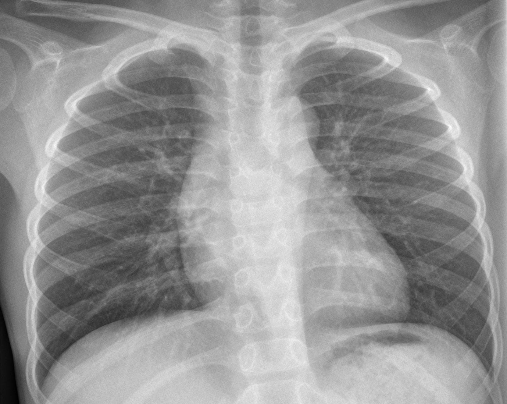
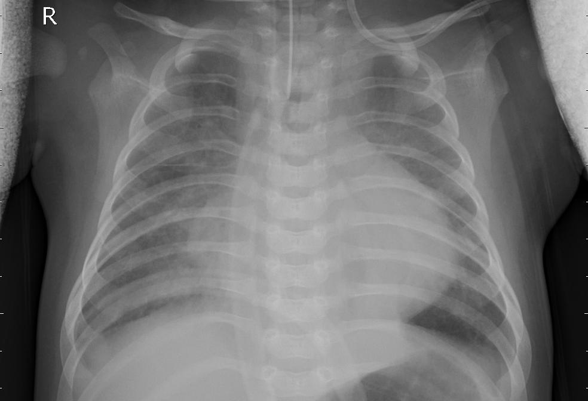

# CNN Pneumonia
A convolutional neutral netwrok for predicting if an 60x60 X-ray image is an X-ray of pneumonia or not.

Healty X-ray:

X-ray with pneumonia:


## Table of content
1.  [Usage](#usage)
    1.  [Required packages](#packages)
    1.  [Input data](#inputData)
1.  [Dataset](#dataset)
1.  [Training](#training)
1.  [Credits](#credits)

<a name="usage"></a>
## Usage
The trained weights are saved in 64-32-Pneumonia-cnn.h5. To use this in your  project add 64-32-Pneumonia-cnn.h5 to your local repo.


```python
import tensorflow as tf
import cv2
import os
import numpy as np
IMG_SIZE = 60

model = tf.keras.models.load_model('64-32-Pneumonia-cnn.h5')

options = ['not pneumonia', 'pneumonia']

#Edit the path to the image
path_for_image = os.path.dirname(os.path.abspath(__file__)) +'\\img\\pneumonia.jpeg'

#resizes the image
img_array = cv2.imread(path_for_image, cv2.IMREAD_GRAYSCALE)
X = cv2.resize(img_array, (IMG_SIZE, IMG_SIZE))

prediction = model.predict(np.asarray(X/255.0).reshape(-1, IMG_SIZE, IMG_SIZE, 1)) #this will return the index of the letter

print(options[prediction[0]]) #will print out if the image contains pneumonia or not
``` 

<a name="packages"></a>
### Required packages
To install the required packages, run the following command in the consol:
```script
pip install -r requirement.txt
```

Packages:
```
Keras==2.3.1
Keras-Applications==1.0.8
Keras-Preprocessing==1.1.0
numpy==1.18.2
opencv-python==4.2.0.34
Pillow==7.1.1
tensorboard==2.2.0
tensorboard-plugin-wit==1.6.0.post3
tensorflow==2.2.0rc2
tensorflow-estimator==2.2.0rc0
```

<a name="inputData"></a>
### Input data
The input data of the model is expected to be a numpy array with shape of (x, 60,60,1). Which means that the input should be a array of 60x60 gray scale images.

<a name="dataset"></a>
## Dataset
The dataset is made by Paul Mooney and uploaded to kaggle. https://www.kaggle.com/paultimothymooney/chest-xray-pneumonia. To use the dataset for training download the dataset and save the images file in a folder named data/

<a name="training"></a>
## Training
1.  Download the dataset from kaggle and save it in a file named data/
2.  Open datapreprocessing.py and change DATADIR to the location of the data
```python
DATADIR = "D:/ml/pneumonia/data"
```
3. Run datapreprocessing.py to create a dataset file, named X.pickle, and a label file, named Y.pickle.
4.  To train the model, open up model.py and choose a name by changing the NAME variable
    ```python
    NAME = f'{layer1}-{layer2}-Pneumonia-cnn-{spatial}-{drop}'
    ```
    1. Run the file named model.py
    2. The model will now be saved in a file that starts with the name given in the variable NAME
5.  To use the model follow the stages in [usage](#usage)


<a name="credits"></a>
## Credits
* Dataset: Mooney, Paul. https://www.kaggle.com/paultimothymooney/chest-xray-pneumonia